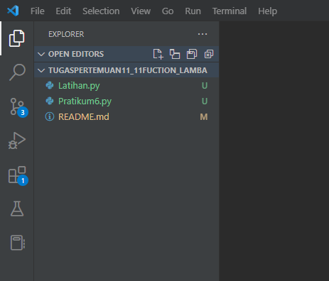
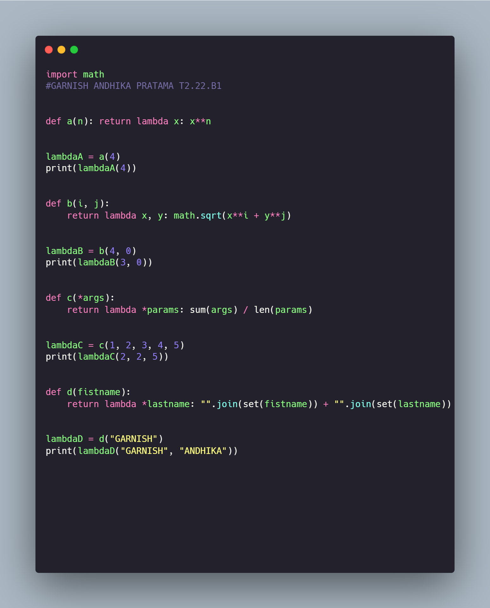
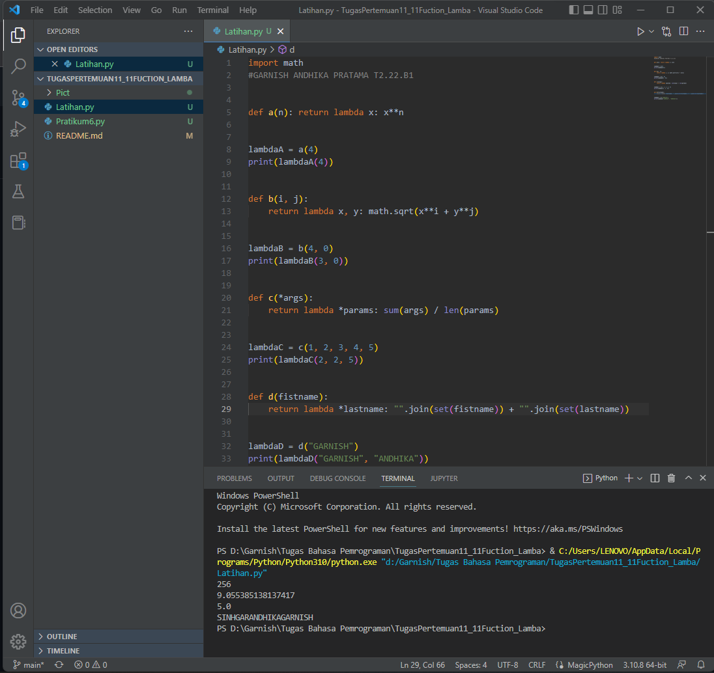
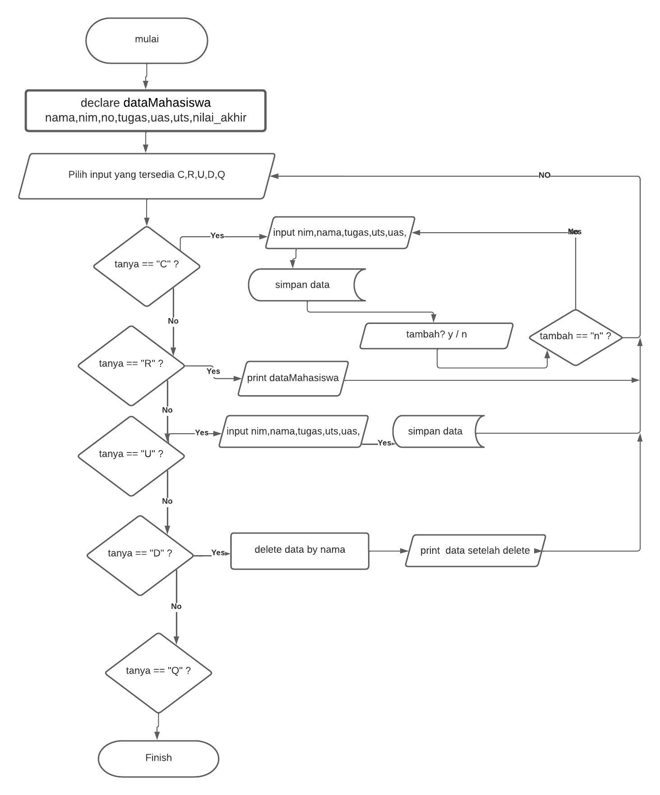
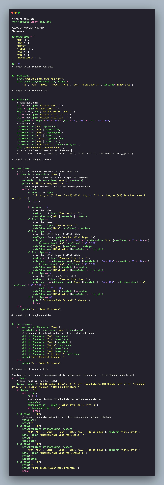

## Latihan Menggunakan Function dan Lambda pada python dan membuat program crud sederhana
### Repository ini dibuat untuk memenuhi tugas kuliah bahasa pemrogramman pertemuan 11

1. Pertama kita buat buat folder `TugasPertemuan11_11Function_Lamba` dan didalam kita buat file bernama `Latihan.py` dan `Praktikum6.py`.

      

2. Lalu buka Latihan.py dan masukan coding sebagai berikut lalu run dengan mengetikan perintah berikut diterminal `python Latihan.py`:

      

      Berikut hasilnya :

      

3. Selanjutnya kita akan buat program crud sederhana dan berikut `flowchart` program yang akan dibuat.

      

4. Lalu buka file `Praktikum6.py` dan masukan codingan sebagai berikut lalu run dengan mengetikan perintah berikut diterminal `python Praktikum6.py`:

      

      Berikut hasilnya :

      Jika memilih opsi `C = Menambah data` maka akan tampil sebagai berikut :

      .png)

      Jika memilih opsi `R = Melihat semua Data` maka akan tampil sebagai berikut :

      .png)

      Jika memilih opsi `U = Update data` maka akan tampil sebagai berikut :

      .png)

      Jika memilih opsi `D = Menghapus Data` maka akan tampil sebagai berikut :

      .png)

      Jika memilih opsi `Q = Keluar Program` maka akan tampil sebagai berikut :

      .png)

## Berikut Langkah-Langkah untuk tugas pertemuan11 tentang Function dan Lambda
### Terimaksih.. 
### Garnish Andhika Prtama (312210161) 

